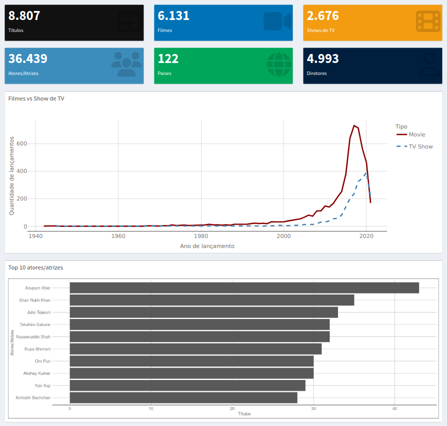
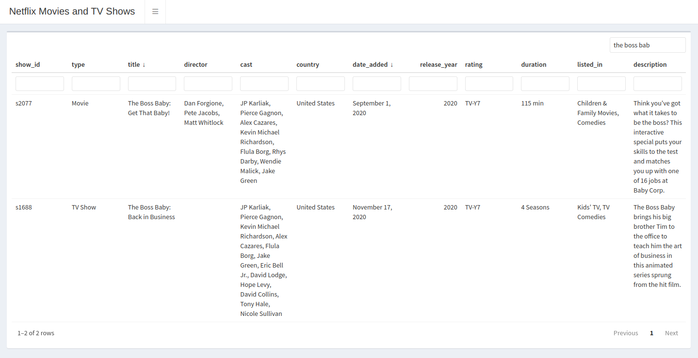
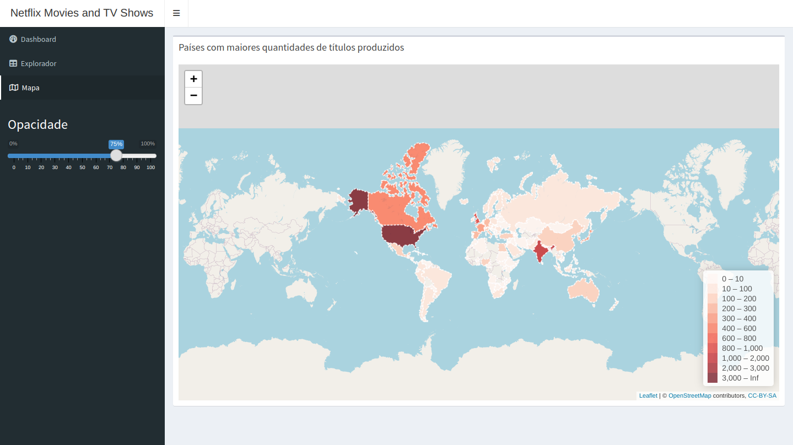
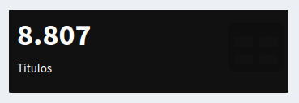
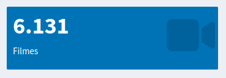
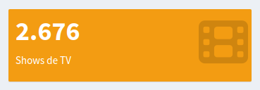
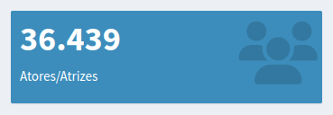
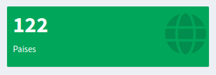
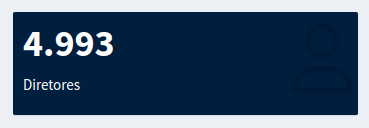
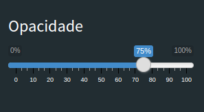

```{r setup, include=FALSE}
knitr::opts_chunk$set(echo = TRUE, eval = FALSE, collapse = TRUE)
```

# Dashboard
## Netflix Movies and TV Shows
### Dataset utilizado disponível no [Kaggle](https://www.kaggle.com/datasets/shivamb/netflix-shows)

O dataset utilizado consiste em uma lista de todos os filmes e programas de TV disponíveis na Netflix, juntamente com detalhes como elenco, diretores, classificações, ano de lançamento, duração, etc. O dashboard implementado exibe algumas informações como a quantidade total de filmes, programas de TV, atores e atrizes, bem como comparações da distribuição dos filmes e shows entre os países, e comparações do crescimento entre filmes e programas de TV ao longo dos últimos anos.

### Implementação
A base do dashboard foi construida usando o [Shiny](https://shiny.rstudio.com/) e o [Shiny Dashboard](https://rstudio.github.io/shinydashboard/).
Para a manipulação dos dados foram utilizadas as bibliotecas [dplyr](https://dplyr.tidyverse.org/), [fuzzyjoin](https://github.com/dgrtwo/fuzzyjoin), [sf](https://r-spatial.github.io/sf/) e [rgdal](https://rdrr.io/cran/rgdal/).
Para a plotagem dos gráficos foi utilizado a biblioteca [ggplot2](https://ggplot2.tidyverse.org/), e para a interatividade dos gráficos a biblioteca [Plotly](https://plotly.com/r/).
Também foi utilizado o pacote do [leaflet](https://rstudio.github.io/leaflet/) para a exibição de um mapa interativo, além de outros pacotes como [ggthemes](https://yutannihilation.github.io/allYourFigureAreBelongToUs/ggthemes/), [reactable](https://glin.github.io/reactable/) e [RColorBrewer](https://r-graph-gallery.com/38-rcolorbrewers-palettes.html).


#### 1. Layout
O layout foi definido utilizando o `shinydashboard` como base, utilizando o `dashboardPage`, `dashboardHeader`, `dashboardSidebar` e `dashboardBody`.
```{r}
ui <- dashboardPage(
  skin = "black",
  dashboardHeader(title = "Netflix Movies and TV Shows", titleWidth = 300),
  dashboardSidebar(
    width = 300,
    sidebarMenu(
      # Items do menu de navegação entre as páginas
      menuItem("Dashboard", tabName = "dashboard", icon = icon("dashboard")),
      menuItem("Explorador", tabName = "explorer", icon = icon("table")),
      menuItem("Mapa", tabName = "map", icon = icon("map")),
      
      # Controle exibido apenas quando estiver na aba do mapa
      uiOutput("mapControls")
    )
  ),
  dashboardBody(
    # ...
  )
)
```

<br>

##### 1.1 Meta tags
Foi adicionado um arquivo CSS customizado para corrigir alguns estilos do dashboard.

Também foi adicionado um código JavaScript simples na página que, sempre que a aba atual é alterada, o Shiny é notificado para atualizar o input `activeTab` no lado do servidor com o nome da aba atual.
```{r}
# ...
dashboardBody(
  # META TAGS
  tags$head(
    tags$link(rel = "stylesheet", type = "text/css", href = "custom.css"),
    
    # Script simples usando jQuery para atualizar a aba ativa no input do Shiny
    tags$script(HTML('
      $(document).ready(function(){
        $("a[data-toggle=tab]").on("show.bs.tab", function(e){
          Shiny.setInputValue("activeTab", $(this).attr("data-value"));
        });
      });
    '))
  ),
  # ...
)
```

<br>

##### 1.2 Abas
Foi utilizado o `tabItems` do `shinydashboard` para definir o conteúdo de cada aba, que são controladas através da interação com os itens do menu lateral (`menuItem`).
```{r}
tabItems(
      # Dashboard ----
      tabItem(
        tabName = "dashboard",
        # ...
      ),
      
      # Explorer ----
      tabItem(
        tabName = "explorer",
        # ...
      ),
      
      # Map ----
      tabItem(
        tabName = "map"
        # ...
      )
)
```

<br>

##### 1.2.1 Aba Dashboard
Na aba **Dashboard** foi utilizada a seguinte estrutura:

1. **Caixas de valor**: Elemento simples para exibir valores numéricos ou de texto, com um ícone.
    + Quantidade total de títulos
    + Quantidade total de filmes
    + Quantidade total de programas de TV
    + Quantidade total de atores e atrizes
    + Quantidade total de paises
    + Quantidade total de diretores
2. **Filmes vs Show de TV (Gráfico)**: Comparativo do crescimento de filmes e programas de TV ao longo dos últimos anos.
3. **Top 10 atores/atrizes (Gráfico)**: Os 10 atores/atrizes que mais aparecem em filmes diferentes.



```{r}
# Dashboard ----
tabItem(
  tabName = "dashboard",
  
  # VALUE BOXES
  fluidRow(
    valueBoxOutput("totalCount"),
    valueBoxOutput("movieCount"),
    valueBoxOutput("tvShowCount"),
    valueBoxOutput("castCount"),
    valueBoxOutput("countriesCount"),
    valueBoxOutput("directorCount"),
  ),
  
  # CHARTS
  fluidRow(
    box(
      width = 12,
      title = "Filmes vs Programas de TV",
      plotlyOutput("moviesVsTvShowPlot")
    ),
    box(
      width = 12,
      title = "Top 10 atores/atrizes",
      plotOutput("top10CastPlot")
    )
  )
)
```

<br>

##### 1.2.2 Aba Explorador
Na aba **Explorador** foi utilizado o pacote `reactable` para exibir uma tabela que permite explorar todo o dataset, com filtro, ordenação, paginação e busca.

```{r}
# Explorer ----
tabItem(
  tabName = "explorer",
  fluidRow(
    box(
      width = 12,
      reactableOutput("explorerTable")
    )
  )
)
```

<br>

##### 1.2.3 Aba Mapa
Na aba **Mapa** foi utilizado o pacote `leaflet` para exibir um mapa interativo que mostra a quantidade de lançamentos por região. Além disso, foi adicionado um `sliderInput` no painel lateral, que aparece somente na aba **Mapa** e serve para alterar a opacidade dos polígonos do mapa.

```{r}
# Map ----
tabItem(
  tabName = "map",
  fluidRow(
    box(
      title = "Países com maiores quantidades de títulos produzidos",
      width = 12,
      leafletOutput("map", height = 'calc(100vh - 200px)')
    )
  )
)
```

<br>
<br>

#### 2. Manipulação dos dados

<br>

##### 2.1 Dashboard

<br>

##### 2.1.1 Total de títulos


Conta todos os títulos distintos e salva na coluna `n`, extrai apenas a coluna `n` e formata o valor.
```{r class.source = 'fold-show'}
nf_titles %>%
    summarize(n = n_distinct(show_id)) %>%
    pull(n) %>%
    format(big.mark = ".", decimal.mark = ",")
```

<br>

##### 2.1.2 Total de filmes


Filtra todos que possuem o valor `Movie` na coluna `type`, conta os títulos distintos e salva na coluna `n`, extrai a propriedade `n` e formata o valor.
```{r class.source = 'fold-show'}
nf_titles %>%
    filter(type == "Movie") %>%
    summarize(n = n_distinct(show_id)) %>%
    pull(n) %>%
    format(big.mark = ".", decimal.mark = ",")
```

<br>

##### 2.1.3 Total de programas de TV


Filtra todos que possuem o valor `TV Show` na coluna `type`, conta os títulos distintos e salva na coluna `n`, extrai a propriedade `n` e formata o valor.
```{r class.source = 'fold-show'}
nf_titles %>%
    filter(type == "TV Show") %>%
    summarize(n = n_distinct(show_id)) %>%
    pull(n) %>%
    format(big.mark = ".", decimal.mark = ",")
```

<br>

##### 2.1.4 Total de atores/atrizes


Separa a coluna de atores/atrizes, converte uma coluna com vários atores/atrizes separados por vírgula em várias linhas com apenas um ator por linha.
```{r class.source = 'fold-show'}
nf_cast = nf_titles %>%
  separate_rows(cast, sep = ",") %>%
  mutate(cast = str_trim(cast, side = "both")) %>%
  filter(cast != "")
```

Conta todos os atores/atrizes distintos e salva na coluna `n`, extrai apenas a coluna `n` e formata o valor.
```{r class.source = 'fold-show'}
nf_cast %>%
      summarise(n = n_distinct(cast)) %>%
      pull(n) %>%
      format(big.mark = ".", decimal.mark = ",")
```

<br>

##### 2.1.5 Total de países


Separa a coluna de países, converte uma coluna com vários países separados por vírgula em várias linhas com apenas um país na coluna.
```{r class.source = 'fold-show'}
nf_countries = nf_titles %>%
  separate_rows(country, sep = ",") %>%
  mutate(country = str_trim(country, side = "both")) %>%
  filter(country != "")
```

Conta todos os países distintos e salva na coluna `n`, extrai apenas a coluna `n` e formata o valor.
```{r class.source = 'fold-show'}
nf_countries %>%
    summarise(n = n_distinct(country)) %>%
    pull(n) %>%
    format(big.mark = ".", decimal.mark = ",")
```

<br>

##### 2.1.6 Total de diretores


Separa a coluna de diretores, conta todos os diretores distintos, salva na coluna `n`, extrai apenas a coluna `n` e formata o valor.
```{r class.source = 'fold-show'}
nf_titles %>%
      separate_rows(director, sep = ",") %>%
      mutate(director = str_trim(director, side = "both")) %>%
      filter(director != "") %>%
      summarise(n = n_distinct(director)) %>%
      pull(n) %>%
      format(big.mark = ".", decimal.mark = ",")
```

<br>

##### 2.1.7 Filmes vs Programas de TV
Agrupa por ano de lançamento e tipo, conta o número distinto de títulos de cada grupo, ordena pelo ano de lançamento e constrói o gráfico. O `x` é o ano de lançamento, o `y` é a quantidade de lançamentos no respectivo ano. O tipo é utilizado para representar o estilo da linha e a cor.

É utilizado o `renderPlotly` e o `ggplotly` para tornar o gráfico criado com o `ggplot` interativo.
```{r class.source = 'fold-show'}
output$moviesVsTvShowPlot <- renderPlotly({
  ggplotly(
    tooltip = c("text"),
    nf_titles %>%
      group_by(release_year, type) %>%
      summarize(n = n_distinct(show_id)) %>%
      arrange(release_year) %>%
      ggplot(aes(
        x = release_year,
        y = n,
        text = paste(
          "<b>", release_year, "</b>",
          "<br>Tipo: ", type,
          "<br>Títulos lançados: ", n
        )
      )) +
      geom_line(
        aes(
          group = 1,
          color = type,
          linetype = type,
        ),
        size = 1
      ) +
      scale_color_manual(values = c("darkred", "steelblue")) +
      labs(color = "Tipo", linetype = NULL, x = "Ano de lançamento", y = "Quantidade de lançamentos")
  )
})
```

<br>

##### 2.1.8 Top 10 atores/atrizes
Agrupa pelos atores/atrizes, o dataset em que a coluna de atores/atrizes já foi separada, conta os títulos distintos, ordena pela contagem em ordem decrescente e pega apenas os 10 primeiros.
```{r class.source = 'fold-show'}
output$top10CastPlot <- renderPlot({
  nf_cast %>%
    group_by(cast) %>%
    summarise(n = n_distinct(show_id)) %>%
    arrange(desc(n)) %>%
    head(10) %>%
    ggplot(aes(
      x = reorder(cast, n),
      y = n
    )) +
    geom_bar(stat = "identity") +
    coord_flip() +
    labs(x = "Atores/Atrizes", y = "Títulos")
})
```

<br>

##### 2.2 Explorador
```{r class.source = 'fold-show'}
output$explorerTable <- renderReactable({
  reactable(nf_titles, defaultSorted = c("date_added", "title"), defaultSortOrder = "desc", filterable = TRUE, searchable = TRUE)
})
```

<br>

##### 2.3 Mapa

<br>

##### 2.3.1 Controle de opacidade


Sempre que a aba ativa for `map` o input de controle de opacidade é renderizado.
```{r class.source = 'fold-show'}
output$mapControls = renderUI({
  if (!is.null(input$activeTab) && input$activeTab == "map") {
    fluidRow(
      column(
        width = 12,
        sliderInput(
          inputId = "mapOpcaitySlider",
          label = h3("Opacidade"),
          min = 0,
          max = 100,
          value = 75,
          post = '%'
        )
      ),
    )
  }
})
```

<br>

##### 2.3.2 Mapa
Primeiro é criado um dataset com a contagem de títulos lançados agrupados por país.
```{r class.source = 'fold-show'}
nf_countries_count <- nf_countries %>%
    group_by(country) %>%
    summarise(n = n_distinct(show_id))
```

Após isso, criamos um novo dataset através da intersecção da contagem de títulos por pais, com a geometria do mapa para cada país.

*Obs.: É preciso usar um join com regex pois pode haver diferenças entre os nomes do GeoJSON e do dataset, como por exemplo: United States e United States of America*

```{r class.source = 'fold-show'}
# É preciso converter para um objeto SF usando `st_as_sf` para que o leaflet encontre as geometrias dos países 
countries_intersection <- st_as_sf(
  world_country %>%
    regex_inner_join(nf_countries_count, by = c(name = "country"), ignore_case = TRUE)
)
```

É criado uma paleta de cores que será usada para pintar as regiões do mapa de acordo com a quantidade de lançamentos da região.
Também é criado um modelo para as labels do tooltip ao passar o mouse sobre uma região.
```{r class.source = 'fold-show'}
pal <- colorBin("Reds", nf_countries_count$n, bins = c(0, 10, 100, 200, 300, 400, 600, 800, 1000, 2000, 3000, Inf))
  
labels <- sprintf(
  "<strong>%s</strong><br/>%d títulos</sup>",
  countries_intersection$name, countries_intersection$n
) %>% lapply(htmltools::HTML)
```

Por último, criamos um mapa do leaflet:
```{r class.source = 'fold-show'}
# Obtém o valor da opacidade do input em forma de porcentagem
opacity <- input[["mapOpcaitySlider"]] / 100

countries_intersection %>%
  leaflet() %>%
  addTiles() %>%
  addPolygons(
    fillColor = ~pal(n), # Obtém a cor da paleta de cores conforme a quantidade de títulos da região
    weight = 2,
    opacity = opacity,
    fillOpacity = opacity,
    color = "white",
    dashArray = "3",
    highlightOptions = highlightOptions(
      weight = 4,
      color = "#222",
      dashArray = "",
      fillOpacity = 0.7,
      bringToFront = TRUE
    ),
    label = labels,
    labelOptions = labelOptions(
      style = list("font-weight" = "normal", padding = "3px 8px"),
      textsize = "15px",
      direction = "auto"
    )
  ) %>%
  addLegend(pal = pal, values = ~n, opacity = 0.7, title = NULL,
            position = "bottomright")
```